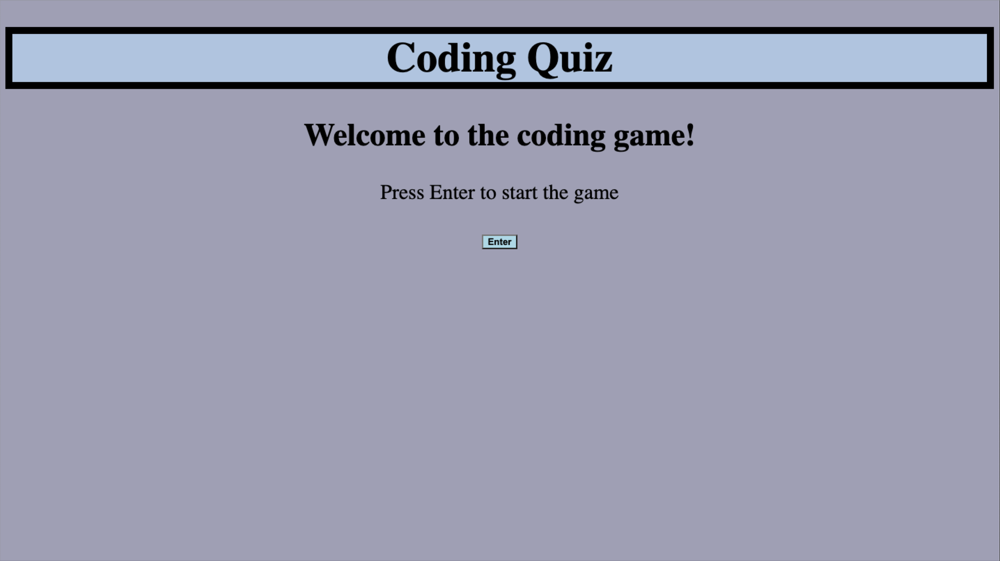
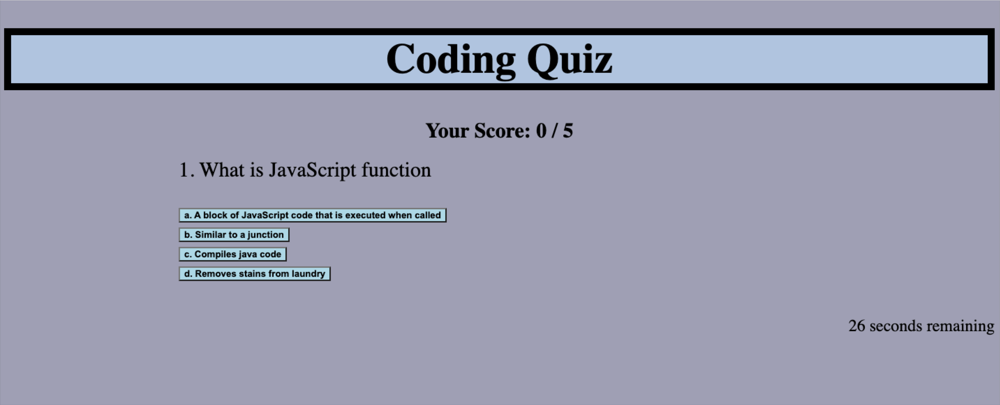
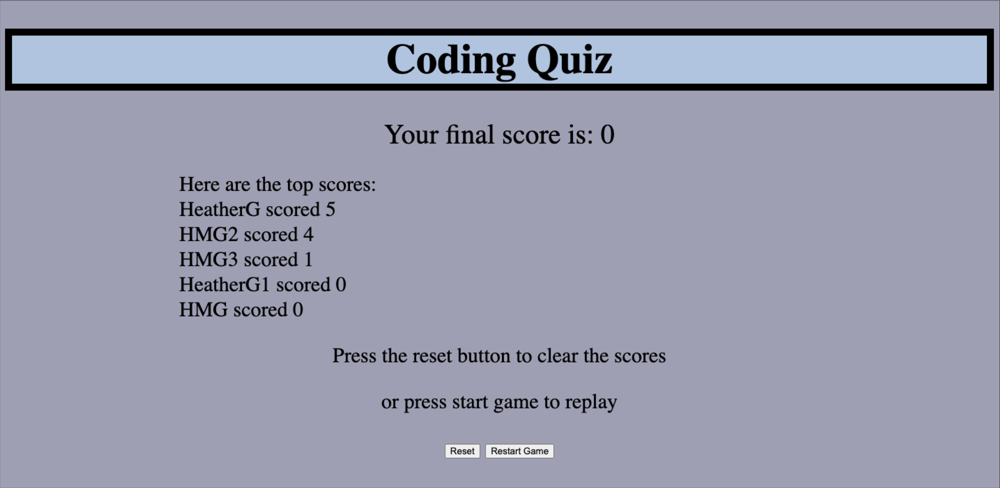

HOMEWORK #4
Quiz can be accessed at https://mtnbiker72.github.io/homework4/

This assignment is to build a timed JavaScript code quiz. 

 * The user has 30 seconds to complete the quiz
 * The timer starts when the start the quiz
 * There are 5 questions
 * When the game is over, the user will be prompted to enter their initials
 * The user's score and initials will be saved in local storage
 * The top 5 scores will be displayed
 * The user can clear the top scores at the end of the game
 * The user can restart the game and take it over

